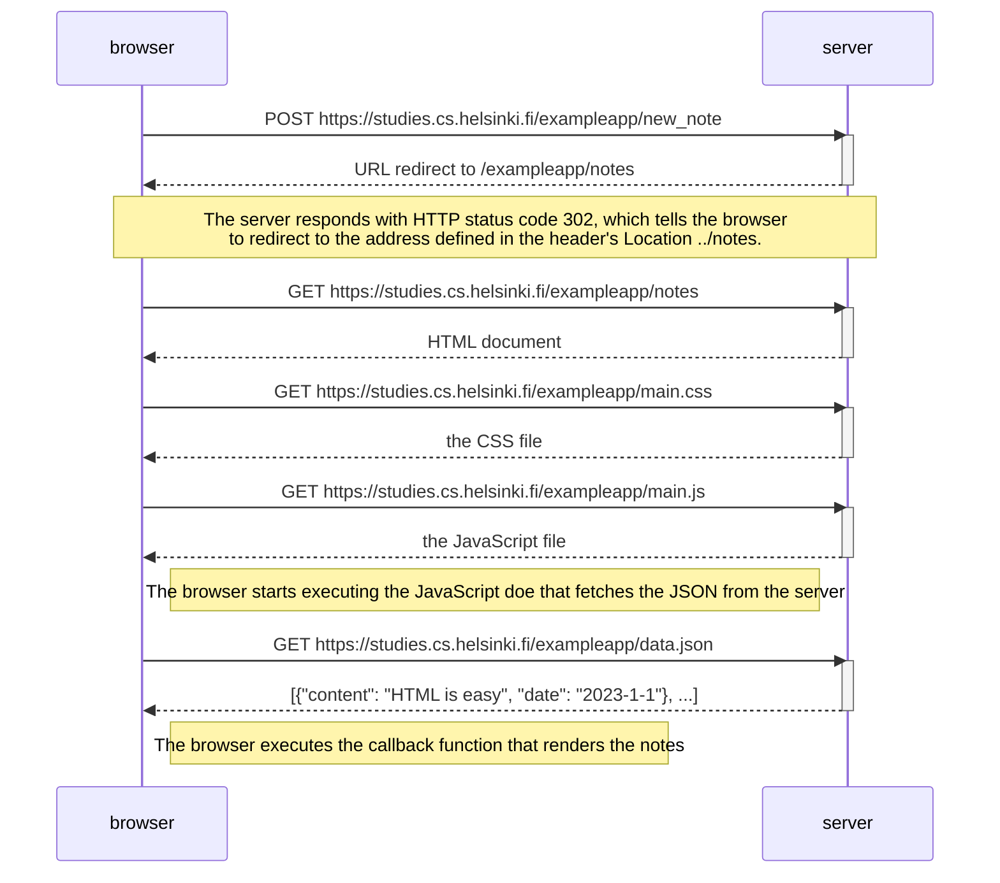

## SEQUENCE DIAGRAM: 
### User creating a new note on page https://studies.cs.helsinki.fi/exampleapp/notes by writing something into the text field and clicking Save button.

```mermaid
sequenceDiagram
    participant browser
    participant server
    browser->>server: POST https://studies.cs.helsinki.fi/exampleapp/new_note
    activate server
    server-->>browser: URL redirect to /exampleapp/notes
    deactivate server
    Note over browser, server: The server responds with HTTP status code 302, which tells the browser<br/>to redirect to the address defined in the header's Location ../notes.
    browser->>server: GET https://studies.cs.helsinki.fi/exampleapp/notes
    activate server
    server-->>browser: HTML document
    deactivate server
    browser->>server: GET https://studies.cs.helsinki.fi/exampleapp/main.css
    activate server
    server-->>browser: the CSS file
    deactivate server
    browser->>server: GET https://studies.cs.helsinki.fi/exampleapp/main.js
    activate server
    server-->>browser: the JavaScript file
    deactivate server
    Note right of browser: The browser starts executing the JavaScript doe that fetches the JSON from the server
    browser->>server: GET https://studies.cs.helsinki.fi/exampleapp/data.json
    activate server
    server-->>browser: [{"content": "HTML is easy", "date": "2023-1-1"}, ...]
    deactivate server
    Note right of browser: The browser executes the callback function that renders the notes

```

