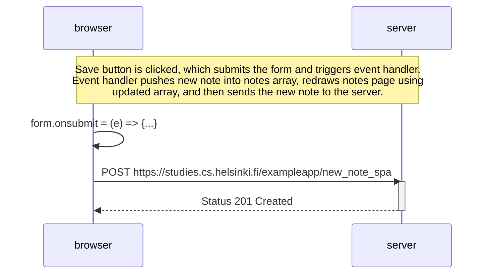

## SEQUENCE DIAGRAM: 
### User creates new note using the single-page version of notes app at https://studies.cs.helsinki.fi/exampleapp/spa.

```mermaid
sequenceDiagram
    participant browser
    participant server
    Note over browser, server: Save button is clicked, which submits the form and triggers event handler.<br/>Event handler pushes new note into notes array, redraws notes page using<br/>updated array, and then sends the new note to the server.
    browser->>browser: form.onsubmit = (e) => {...}
    browser->>server: POST https://studies.cs.helsinki.fi/exampleapp/new_note_spa
    activate server
    server-->>browser: Status 201 Created
    deactivate server
```
