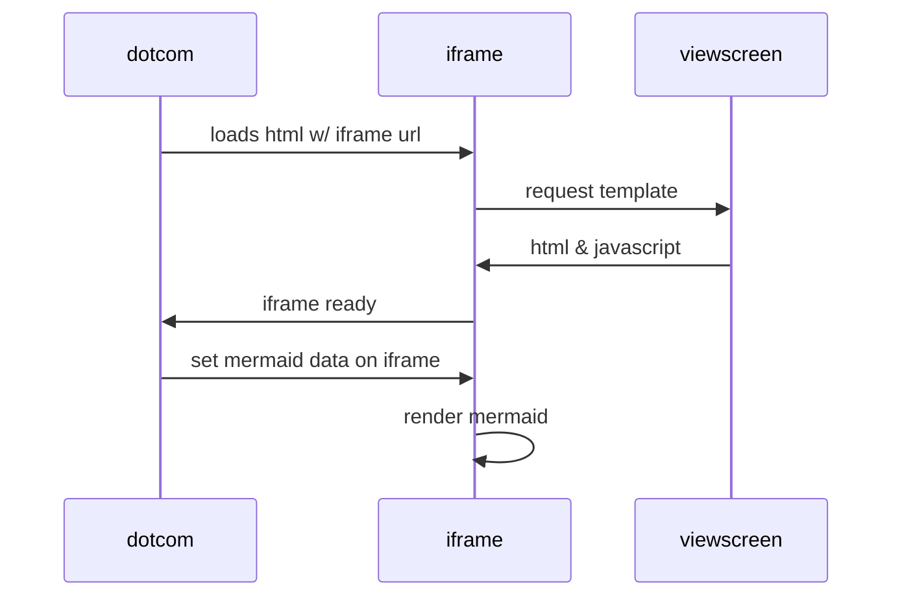

# mermaid
test for mermaid



```mermaid
sequenceDiagram
    participant browser
    participant server
    browser->>server: GET https://studies.cs.helsinki.fi/exampleapp/notes
    browser<<-server: HTML document
    browser->>server: GET https://studies.cs.helsinki.fi/exampleapp/main.css
    browser<<-server: the CSS file
    browser->>server: GET https://studies.cs.helsinki.fi/exampleapp/main.js
    browser<<-server: the JavaScript file
    browser->>server: GET https://studies.cs.helsinki.fi/exampleapp/data.json
    %% browser<<-server: [{"content": "HTML is easy", "date": "2023-1-1"}, ...]
```

